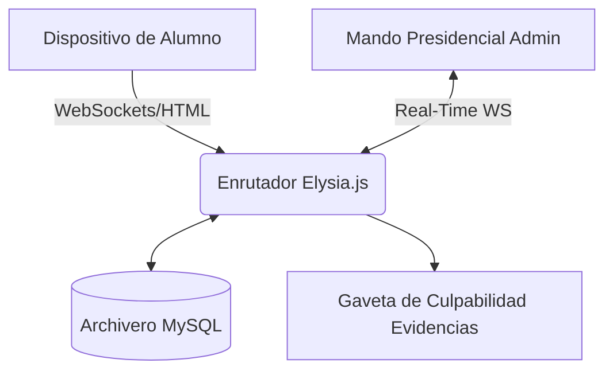

<p align="center">
  
</p>

<p align="center">
  <a href="https://qwik.builder.io/"></a>
  <a href="https://bun.sh/"></a>
  <a href="https://elysiajs.com/"></a>
  <a href="https://tailwindcss.com/"></a>
</p>

<p align="center">
  <a href="README.md">🇬🇧 English</a> |
  <a href="README.id.md">🇮🇩 Bahasa Indonesia</a> |
  <a href="README.ms.md">🇲🇾 Bahasa Melayu</a> |
  <a href="README.es.md">🇪🇸 Español</a>
</p>

---

# 🎓 Examinator (Edición Española)

**La Plataforma SaaS Definitiva de Sistema de Exámenes Basados en Computadora (CBT) con Supervisión de Proctoring Inteligente.**

Construido íntegramente para soportar entornos de alto riesgo educacional y prevenir rotundamente las trampas virtuales. Examinator compila una excepcional agilidad informática junto a escáneres heurísticos robustos en una amalgama de código abierto inigualable.


## 🌟 Características Principales

### 🛡️ Motor Censor Examinador

- **Forensis de Interfaz**: Al momento que un estudiante intercambie navegaciones a otra vitrina de internet u otra ventana el `Page Visibility API` delatariá ipso-facto sus quehaceres deshonrosos .
- **Desenfoque Visual (Blur Hooks)**: Reacciones adversas si la pantalla principal pierde encuadre .
- **Tiranía De Pantalla Completa**: Otorga amonestaciones terminales tras apachurrarse la tecla de escape de pantalla (`Esc`).
- **Sentencia Biométrica Inviolable**: De reincidir las penalizaciones el Ojo central activa capturas infragantis recolectando vídeos penales y evidencias fílmicas 3 segundos que vuelan encriptados hacia la guarida del Profesorado/Admin.

### ⚡ Rapidez Estratosférica

- **Tecnología Resumable (Qwik)**: Sin cargas innecesarias de _JavaScript_. Rapidez al abrir a $O(1)$.
- **Flujo Ecosistémico Bun.js**: Transportes WebSocket supersónicos enlazados vía backend C++ uWebSockets con Elysia para albergar multitudes sin latencia aparente.

## 🏛️ Sistema Arquitectural



---

## 🚀 Despegue Instalador

1. Clonar Matriz:
   ```bash
   git clone https://github.com/examinator/examinator.git
   cd examinator
   ```
2. Instalar Librerías:
   ```bash
   npm install
   ```
3. Mapeo Del Ecosistema Local:
   ```bash
   cp .env.example .env
   ```
4. Subir y Despachar Tableros DB:
   ```bash
   npm run db:push
   ```
5. Iniciar Encendido Desarrollo Motor:
   ```bash
   npm run dev
   ```

---

## 🤝 Voluntariados y Documentación

Solicitamos a nuestros benefactores e interesados encarecidamente revisar la doctrina de estatutos del lugar antes de ofrendarnos aportes de códigos :

- **[Aportaciones (Contributing)](CONTRIBUTING.es.md)**
- **[Políticas de Defensas Técnicas (Security)](SECURITY.es.md)**
- **[Doctrina Ética de Modales (Code of Conduct)](CODE_OF_CONDUCT.es.md)**

Cimientos Intelectuales Licenciados Por **[Licencia MIT](LICENSE.es.md)**.
