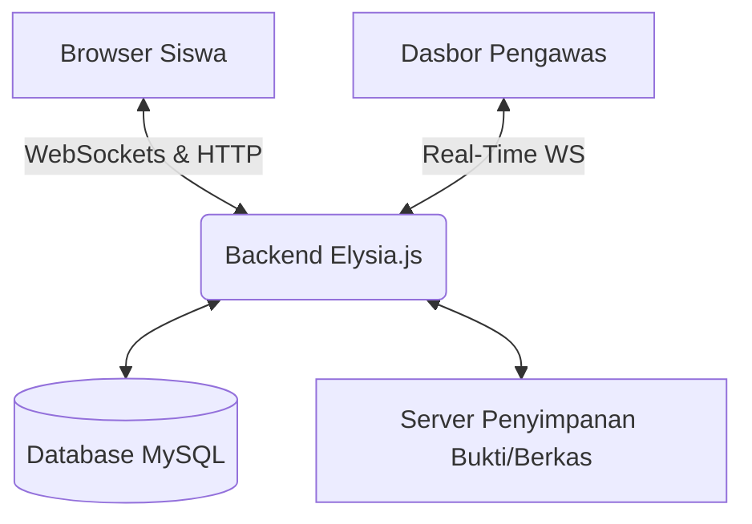

<p align="center">
  
</p>

<p align="center">
  <a href="https://qwik.builder.io/"></a>
  <a href="https://bun.sh/"></a>
  <a href="https://elysiajs.com/"></a>
  <a href="https://tailwindcss.com/"></a>
  <a href="https://www.prisma.io/"></a>
</p>

<p align="center">
  <a href="https://github.com/examinator/examinator/blob/main/LICENSE.id.md">
    
  </a>
  
</p>

<p align="center">
  <a href="README.md">🇬🇧 English</a> |
  <a href="README.id.md">🇮🇩 Bahasa Indonesia</a> |
  <a href="README.ms.md">🇲🇾 Bahasa Melayu</a> |
  <a href="README.es.md">🇪🇸 Español</a>
</p>

---

# 🎓 Examinator (Edisi Indonesia)

**Sistem Aplikasi SaaS Computer-Based Test (CBT) Terpusat dengan Fitur _Proctoring_ Canggih.**

Dirancang khusus untuk ekosistem pendidikan tinggi dan sekolah kejuruan, diadaptasi secara sempurna untuk **Kurikulum Merdeka di SMK Indonesia**. Examinator memadukan performa ekstrem dengan mesin heuristik anti-mencontek yang sangat ketat.


## 🌟 Fitur Utama

### 🛡️ Mesin Proctoring Anti-Kecurangan Tingkat Tinggi

- **Forensik Pemindahan Tab**: Mendeteksi secara instan apabila siswa berpindah tab atau membuka aplikasi lain dengan memanfaatkan _Native Page Visibility API_.
- **Kait Fokus Browser**: Alat pendeteksi kejadian ketika _browser window_ tidak lagi menjadi fokus utama (Blur event).
- **Penguncian Layar Penuh (Fullscreen)**: Mewajibkan siswa masuk ke mode _fullscreen_. Jika ditekan tombol `Esc`, sistem langsung mendeteksi ancaman secara _real-time_.
- **Perekaman Bukti Kamera Visual**: Meminta persetujuan wajib kamera. Jika siswa melakukan kecurangan, mekanisme sistem secara otomatis **merekam 3-detik video atau foto** sebagai bukti forensik digital yang sah.

### ⚡ Performa Super Kilat

- **Antarmuka Qwik (Resumability)**: Pemuatan halaman hanya butuh $O(1)$ waktu konstan. Sangat hemat bandwidth untuk sekolah di daerah dengan koneksi terbatas.
- **Asynchronous Bun Ecosystem**: Digerakkan oleh **Bun** + **Elysia.js**, menyajikan WebSocket instan tanpa henti untuk memantau ratusan siswa pada dasbor monitor tanpa patah-patah.

### 🧩 Ekosistem Premium Berkelas

- **Arsitektur Monorepo**: _Client_ (Frontend) & _Server_ (Backend) diselaraskan dalam satu kesatuan agar _Typescript type-safety_ terjaga.
- **Database Relasional**: Ditenagai oleh **Prisma ORM** + MySQL untuk memastikan integritas dan kestabilan data log ujian.

---

## 🏛️ Arsitektur Sistem



---

## 🚀 Panduan Memulai Cepat

### 📋 Prasyarat Komputer Server

- [Bun](https://bun.sh/) (Versi terbaru)
- MySQL / MariaDB Server

### 🛠️ Pemasangan Kode

**1. Kloning repositori:**

```bash
git clone https://github.com/examinator/examinator.git
cd examinator
```

**2. Instalasi Paket:**

```bash
npm install
```

**3. Konfigurasi Lingkungan:**

```bash
cp .env.example .env
# Edit isi file .env dan masukkan DATABASE_URL database anda
```

**4. Migrasi Skema Database:**

```bash
npm run db:push
npm run db:generate
```

**5. Nyalakan Server:**

```bash
npm run dev
# Server aktif di port 8080 (Backend)
# Client UI aktif di port 5173 (Frontend)
```

---

## 📚 Dokumentasi Tingkat Lanjut (Advanced)

Untuk para Arsitek Sistem, Engineer, dan Kepala Sekolah IT, kami telah mempersiapkan set dokumen komprehensif _(Agile)_ yang terdapat di dalam direktori `docs/`:

1. 📖 [Product & Sprint Backlog](docs/1-product-backlog.md)
2. 🏗️ [Arsitektur Sistem (System Architecture)](docs/2-system-architecture.md)
3. 🗄️ [Skema Database & ERD](docs/3-database-schema.md)
4. 🔌 [Referensi API (Endpoints)](docs/4-api-reference.md)
5. 🚀 [Panduan Deployment Skala Produksi](docs/5-deployment-guide.md)
6. 📄 [Dokumen SRS Bersertifikasi IEEE](docs/6-srs-document.md)
7. 🎓 [Karya Tulis Ilmiah & Penelitian](docs/7-karya-tulis-ilmiah.md)
8. 🔄 [Agenda Panduan Agile Scrum](docs/8-agile-ceremonies.md)
9. 🧪 [Metodologi QA & Test Plan](docs/9-test-plan.md)

---

## 🤝 Komunitas Sumber Terbuka (_Open Source_)

Kami mengundang Anda untuk berkontribusi. Sebelum melakukan _Pull Request_, bacalah ikrar komunitas kami:

- 🧑‍💻 **[Panduan Berkontribusi](CONTRIBUTING.id.md)**
- 🛡️ **[Kebijakan Keamanan (Security)](SECURITY.id.md)**
- 🤝 **[Kode Etik (Code of Conduct)](CODE_OF_CONDUCT.id.md)**

---

## ⚖️ Lisensi Kebebasan (License)

Examinator adalah dedikasi kepada masyarakat dunia, dirilis di bawah **[Lisensi MIT](LICENSE.id.md)**.

<p align="center">
  <i>Dibangun dengan ❤️ oleh Section Head Senior Creative Full Stack Engineer - Adobe & Microsoft Certified.</i>
</p>
