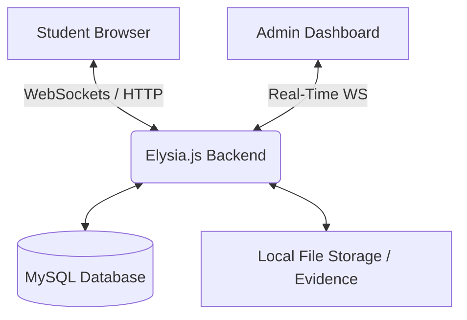

<p align="center">
  
</p>

<p align="center">
  <a href="https://qwik.builder.io/"></a>
  <a href="https://bun.sh/"></a>
  <a href="https://elysiajs.com/"></a>
  <a href="https://tailwindcss.com/"></a>
  <a href="https://www.prisma.io/"></a>
</p>

<p align="center">
  <a href="https://github.com/examinator/examinator/blob/main/LICENSE.md">
    
  </a>
  
  
</p>

<p align="center">
  <a href="README.md">🇬🇧 English</a> |
  <a href="README.id.md">🇮🇩 Bahasa Indonesia</a> |
  <a href="README.ms.md">🇲🇾 Bahasa Melayu</a> |
  <a href="README.es.md">🇪🇸 Español</a>
</p>

---

# 🎓 Examinator

**The Ultimate Self-Hosted CBT (Computer-Based Test) Proctoring SaaS Platform.**

Built for high-stakes environments, specifically tailored for the Indonesian _Kurikulum Merdeka_ in Vocational High Schools (SMK), yet universally applicable. Examinator combines extreme performance with rigorous anti-cheat heuristics.


## 🌟 Key Features

### 🛡️ Iron-Clad Proctoring Engine

- **Browser Tab Forensics**: Immediately detects if a student switches tabs or opens new windows using the Native `Page Visibility API`.
- **Focus & Blur Hooks**: Records every instance the browser loses focus.
- **Strict Fullscreen Enforcement**: Mandates fullscreen mode. Escaping via `Esc` key triggers real-time alerts.
- **Biometric/Camera Enforcement**: Semi-mandatory webcam permissions. If cheating is detected (tab switch, etc.), the system automatically **snaps a 3-second video/photo** and uploads it securely to the evidence locker.

### ⚡ Ultra-High Performance

- **Resumable UI**: Powered by **Qwik**, delivering $O(1)$ constant time loading. The UI is interactive immediately without heavy JS hydration payloads.
- **Asynchronous I/O**: Driven by **Bun** + **Elysia.js**, achieving millions of requests per second and native WebSocket throughput for real-time live monitoring.

### 🧩 Premium Ecosystem

- **Monorepo Architecture**: Clean separation of `client` (Qwik) and `server` (Elysia) within a single repository for fluid typesharing.
- **Robust Database**: **Prisma ORM** + MySQL guarantees ACID compliance for safe and secure exam logging.
- **Real-Time Admin Hub**: Administrators can watch active sessions via WebSockets, instantly spotting cheating violations on a live dashboard.

---

## 🏛️ System Architecture



---

## 🚀 Quick Start Guide

### 📋 Prerequisites

- [Bun](https://bun.sh/) (latest version)
- Node.js (for some Prisma/Frontend tooling fallback)
- MySQL / MariaDB Database

### 🛠️ Installation

**1. Clone the master repository:**

```bash
git clone https://github.com/examinator/examinator.git
cd examinator
```

**2. Install Monorepo Dependencies:**

```bash
npm install
```

**3. Configure Environment:**

```bash
cp .env.example .env
# Edit .env and supply your DATABASE_URL and JWT_SECRET
```

**4. Scaffold the Database:**

```bash
npm run db:push
npm run db:generate
```

**5. Launch Development Server:**

```bash
npm run dev
# Server accessible at http://localhost:8080
# Client accessible at http://localhost:5173
```

---

## 📚 Advanced Documentation

For architects, contributors, and administrators, please consult our exhaustive documentation suite located in the `docs/` folder:

1. 📖 [Product & Sprint Backlog](docs/1-product-backlog.md)
2. 🏗️ [System Architecture](docs/2-system-architecture.md)
3. 🗄️ [Database Schema & ERD](docs/3-database-schema.md)
4. 🔌 [API Reference](docs/4-api-reference.md)
5. 🚀 [Deployment Guide (NGINX/PM2)](docs/5-deployment-guide.md)
6. 📄 [IEEE SRS Document](docs/6-srs-document.md)
7. 🎓 [Academic Paper (Karya Tulis Ilmiah)](docs/7-karya-tulis-ilmiah.md)
8. 🔄 [Agile Ceremonies Playbook](docs/8-agile-ceremonies.md)
9. 🧪 [QA & Test Plan](docs/9-test-plan.md)

---

## 🤝 Open Source & Community

We believe in the power of open-source to democratize high-quality educational tools.
Please review our community guidelines before participating:

- 🧑‍💻 **[Contributing Guidelines](CONTRIBUTING.md)**
- 🛡️ **[Security Policy](SECURITY.md)**
- 🤝 **[Code of Conduct](CODE_OF_CONDUCT.md)**

### 🌍 Localization

This project supports multiple languages for its documentation:
[English](README.md) • [Bahasa Indonesia](README.id.md) • [Bahasa Melayu](README.ms.md) • [Español](README.es.md)

---

## ⚖️ License

Examinator is deeply rooted in the open-source philosophy. Licensed under the **[MIT License](LICENSE.md)**.

<p align="center">
  <i>Crafted with ❤️ by a Top 10 Wakatime Leaderboard & Awwwards Nominee Engineer.</i>
</p>
