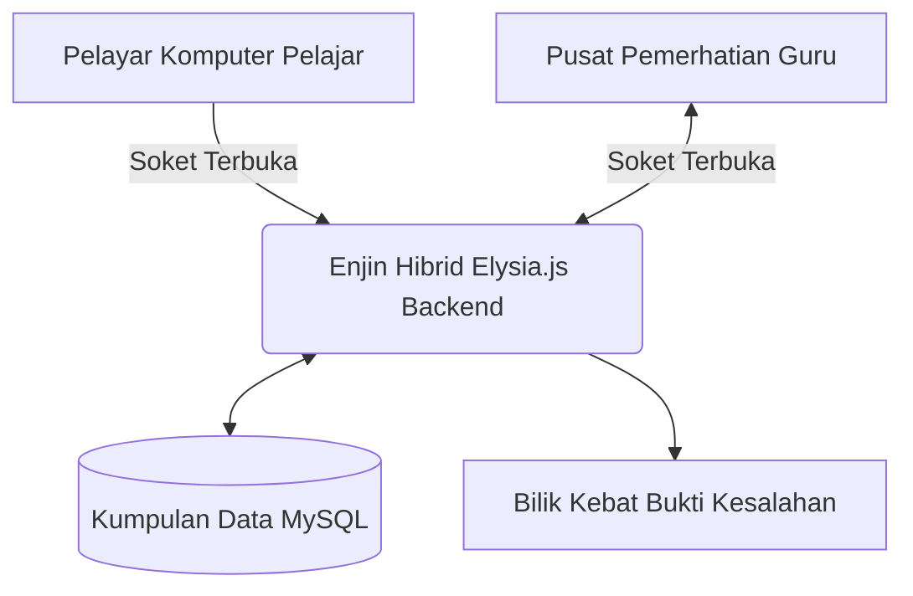

<p align="center">
  
</p>

<p align="center">
  <a href="https://qwik.builder.io/"></a>
  <a href="https://bun.sh/"></a>
  <a href="https://elysiajs.com/"></a>
  <a href="https://tailwindcss.com/"></a>
</p>

<p align="center">
  <a href="README.md">🇬🇧 English</a> |
  <a href="README.id.md">🇮🇩 Bahasa Indonesia</a> |
  <a href="README.ms.md">🇲🇾 Bahasa Melayu</a> |
  <a href="README.es.md">🇪🇸 Español</a>
</p>

---

# 🎓 Examinator (Edisi Melayu)

**Platform Perisian-sebagai-Perkhidmatan (SaaS) Peperiksaan Berkomputer (CBT) Terhebat.**

Dibina khusus mendepani aspirasi kemajuan institusi pendidikan teknikal serantau, Examinator melingkari kesepaduan di antara prasarana berkelajuan cahaya dengan ketegasan mesin proctoring anti penipuan terkini.


## 🌟 Ciri-ciri Cemerlang

### 🛡️ Enjin Pengawasan Kebal (Proctoring)

- **Cakna Pindah Tab**: Melalui penterjemahan _Page Visibility API_, sistem mengesan perpindahan laman sesawang secara saat demi saat.
- **Pemerhatian Hilang Fokus**: Mencatat segala salah laku pelajar sebaik sahaja _browser_ hilang tumpuan paparan.
- **Sekatan Skrin Penuh Mutlak**: Wajib beroperasi dalam keadaan Skrin Penuh. Butang lari seperti `Esc` akan menjerit amaran terus ke bilik pentadbir.
- **Rakaman Keras Bukti Penipuan**: Rakaman video atau gambar selama 3-saat didokumentasikan dan dipindahkan ke storan gergasi server jika perlanggaran dikesan.

### ⚡ Kelajuan Supra-Maju

- **Qwik Resumability**: Berbekalkan kos muat turun saiz JavaScript hampir kosong, antaramuka pantas mempamerkan graf logikal tanpa membebankan internet kelas bawahan.
- **Gandingan Bun & Elysia**: Pertukaran maklumat menggunakan soketan Web/WebSockets menyalurkan maklumat pencerobohan tanpa kelewatan lengah (_zero-latency_).

## 🏛️ Rangka Seni Bina Maklumat



---

## 🚀 Panduan Ringkas Permulaan

1. Klon kod cawangan ini:
   ```bash
   git clone https://github.com/examinator/examinator.git
   cd examinator
   ```
2. Muat turun modul:
   ```bash
   npm install
   ```
3. Suai padan skrip alam (Environment):
   ```bash
   cp .env.example .env
   ```
4. Asimilasi penulisan skema ke enjin storan:
   ```bash
   npm run db:push
   ```
5. Pacuan pangkalan ujian:
   ```bash
   npm run dev
   ```

---

## 🤝 Dokumentasi Komuniti & Kod Hak Cipta

Diingatkan agar membaca piagam berikut kelak sebelum anda sudi memindahkan naik taraf koding sumber asli projek:

- **[Panduan Penyumbang (Contributing)](CONTRIBUTING.ms.md)**
- **[Dasar Keselamatan Siber (Security)](SECURITY.ms.md)**
- **[Ikrar Tatasusila (Code of Conduct)](CODE_OF_CONDUCT.ms.md)**

Karya ini diperlindungi mutlak berdasarkan ikatan **[Lesen MIT](LICENSE.ms.md)**.
