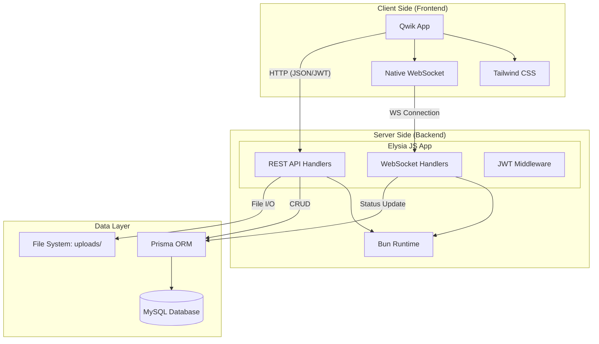

# 2. System Architecture

Examinator mengadopsi arsitektur **Monorepo** untuk menyatukan _frontend_ dan _backend_ dalam satu repositori, memfasilitasi integrasi dan _deployment_ yang lebih kohesif.

## 🏗️ Gambaran Arsitektur

Arsitektur aplikasi ini berbasis pada model **Client-Server** dengan komunikasi data melalui REST API dan WebSockets (Pub/Sub).



## 🛠️ Pemilihan Teknologi Dasar

1. **Frontend: Qwik Framework**
   - **Alasan**: _Resumability_. Qwik tidak memerlukan proses _hydration_ yang berat di perangkat. Aplikasi Exam sering memuat banyak soal sekaligus yang pada framework React biasa (SPA) akan menyebabkan "freeze" atau _bottleneck_ RAM di perangkat HP/Laptop berspek rendah.
   - **Styling**: Menggunakan Tailwind CSS v4 dengan ekstensi animasi agar desain terlihat premium.

2. **Backend: Elysia JS + Bun**
   - **Alasan**: Bun sangat _performant_ dibanding Node.js standar. Elysia JS adalah _web framework_ yang didesain secara spesifik untuk Bun, memberikan performa sekelas Go/Rust namun dengan bahasa TypeScript.
   - **WebSocket**: Elysia menggunakan _uWebSockets_ secara _native_ di balik layar, memampukan fitur pemantauan 300+ pengguna _concurrent_ di dashboard Proktor tanpa lag berarti.

3. **Database: MySQL + Prisma ORM**
   - **Alasan MySQL**: Sistem Ujian Nasional dan CBT lokal sangat bergantung pada _ACID compliance_ (integritas transaksional) relasional.
   - **Alasan Prisma**: Prisma menjembatani _query_ rumit dengan tipe data (_Type-Safety_), menyambung dari database ke _interface_ TypeScript di backend dengan sempurna.

## 📁 Lapisan Folder / Directory Tree

```
examinator/
├── client/
│   ├── src/
│   │   ├── components/  # Komponen GUI (Auth, Modals, Cards)
│   │   ├── hooks/       # Custom hooks (Kamera, Deteksi Kecurangan)
│   │   ├── lib/         # API Fetcher (Axios wrapper), WS Singleton
│   │   └── routes/      # File-based routing (Admin, Siswa, Proktor)
│
├── server/
│   ├── prisma/          # Konfigurasi Schema MySQL & Seed Data
│   ├── src/
│   │   ├── middleware/  # Filter akses (Auth JWT)
│   │   ├── routes/      # Rute REST API Endpoints
│   │   └── ws/          # Router Websockets (Pub/Sub)
│   └── uploads/         # Storage media bukti kecurangan (foto/video)
│
└── package.json         # Master NPM/Bun workspace script
```

## 🔐 Alur Autentikasi (Auth Flow)

1. Klien mengirim _Username_ dan _Password_ ke `/api/auth/login`.
2. Backend menggunakan `bcrypt` untuk membandingkan.
3. Backend merespons menggunakan **JWT (JSON Web Token)**.
4. Token disimpan di `localStorage` Klien.
5. Klien mengirimkan `Authorization: Bearer <token>` di header setiap _request_ yang diproteksi.
