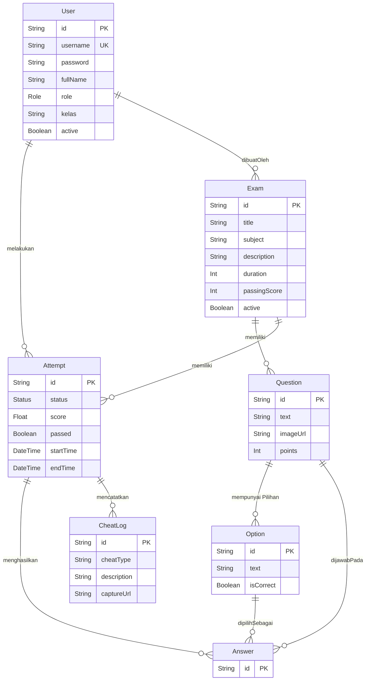

# 3. Database Schema

Dokumen ini memuat skema database yang dikelola oleh Prisma ORM (`server/prisma/schema.prisma`). Database menggunakan MySQL secara relasional untuk mempertahankan integritas data ujian.

## 🗄️ Relasi Entitas (ERD)

## 📝 Tabel Utama

### 1. User

Menyimpan data pengguna (Siswa, Operator/Proktor, Admin).

- `role`: Enum `[ADMIN, OPERATOR, STUDENT]` digunakan untuk _Role-Based Access Control_ (RBAC) dalam manajemen menu dan akses.
- `kelas`: (Opsional) Mengelompokkan berdasarkan kelas untuk siswa.

### 2. Exam

Mengatur identitas dan parameter tes.

- `duration`: Memegang peran dalam waktu hitung mundur ujian (dalam menit).
- `passingScore`: Menentukan batas kelulusan siswa _(KKM)_.
- Secara relasional menyimpan siapa `Admin` yang membuat ujiannya.

### 3. Question & Option

Sistem saat ini menganut skema **Pilihan Ganda (Multiple Choice)**.

- Setiap _Question_ dapat memegang lebih dari 2 opsi pilihan dalam entitas `Option`.
- Hanya satu kombinasi opsi yang diset bernilai `isCorrect = true`.

### 4. Attempt

Tabel transaksi sesi ujian per siswa. Kunci utama untuk mendata riwayat pengerjaan siswa.

- Berisi rekam status: `[IN_PROGRESS, SUBMITTED, TIMED_OUT]`.
- Merekam skor perhitungan akhir.

### 5. Answer

Mencatat detail jawaban yang diberikan untuk entitas `Attempt` spesifik. Relasi tersambung ke `Question` dan `Option` mana yang dipilih.

### 6. CheatLog

Tabel logikal khusus proctoring. Menyimpan data peringatan.

- `cheatType`: Misal `"TAB_SWITCH"`, `"FULLSCREEN_EXIT"`, `"CAMERA_OFF"`.
- `captureUrl`: URL menuju gambar `.jpg` / video lokal `.webm` yang difoto diam-diam (jika kamera menyala) sebagai barang bukti audit laporan akhir.
