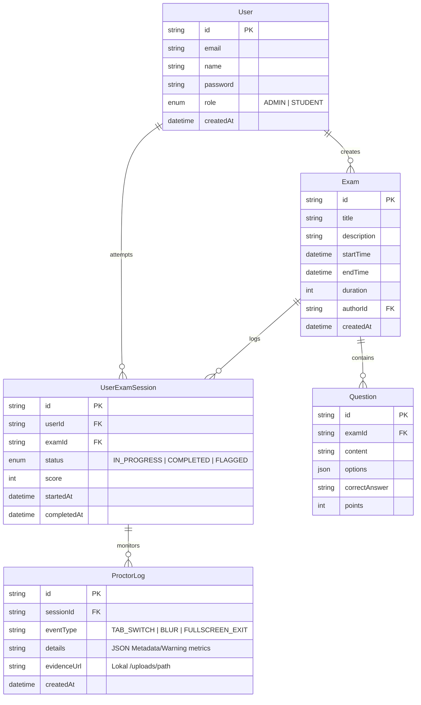

  

# 3. Database Schema 🗄️

Dokumen ini memuat skema database yang dikelola oleh Prisma ORM (`server/prisma/schema.prisma`). Database menggunakan MySQL secara relasional untuk mempertahankan integritas data ujian dengan jaminan keamanan ACID.

## 🗺️ Relasi Entitas (ERD)

## 📖 Deskripsi Model Lanjut (Advanced Dict)

### 1. `User` (Identitas Hak Akses)

Menampung entitas profil dengan batasan izin:

- **`role`**: Mengindikasi izin. Hanya pengguna ber-tipe `ADMIN` yang diizinkan memanipulasi baris data `Exam` dan mengakses papan dasbor `/admin` monitor.

### 2. `Exam` (Struktur Paket Ujian)

Induk kerangka soal:

- **`startTime`** / **`endTime`**: Penetapan kronometri pembatasan jadwal di dalam rentang waktu yang direstui oleh server.
- **`duration`**: Kuota menit efektif. Digunakan di klien oleh timer _Count-down_.

### 3. `Question` (Distribusi Soal)

- **`options`**: Tipe `JSON` yang menaungi larik variasi opsi `A, B, C, D`.
- **`correctAnswer`**: Dikunci dan hanya diobservasi tatkala `UserExamSession` dikirim untuk kalkulasi skoring parsial server.

### 4. `UserExamSession` (Tiket Masuk Ujian)

- **`status`**: State Machine penentu kelangsungan status sesi ujian (`IN_PROGRESS` -> `COMPLETED`, atau dipaksa diskualifikasi secara sejuk oleh Pendidik `FLAGGED`).
- **`score`**: Kalkulasi perolehan poin mutlak akhir yang tertulis secara independen sesaat sesudah pengumpulan `POST /api/exams/submit`.

### 5. `ProctorLog` (Ledakan Tsunami Audit Forensik)

Arsip penggelaran interupsi pelanggaran. Menyimpan historis kejahatan proctoring:

- **`eventType`**: Jenis penyelewengan (_Tab, Blur, Focus, Fullscreen_).
- **`details`**: Konteks anomali (Deskripsi metadata, kronometri).
- **`evidenceUrl`**: Tautan mutlak media barang bukti (`/uploads/{video_id}.webm` atau `.jpg`). Diambil dari tangkapan pelapor kamera sisipan klien ketika peringatan dilesatkan.

---

> _**Catatan Keselamatan**: Data rahasia kandidat seperti `password` telah diasimilasikan algoritma asimetrik kuat (Bcrypt) pra-insersi lewat lapisan konfig DB prisma middleware (bun `password.hash`)._
